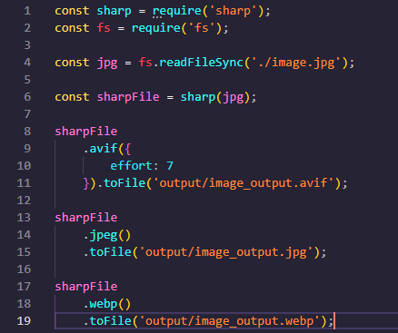

# 10Up.com Improvement suggestions

This is a small write up on 10Up's website and some improvements that can be made, but this isn't an exhaustive list and I have also mostly stuck to the home page. Though the ideas and thoughts here can be transfered to the other pages as well.

Here's my plan on what I'll be looking into:

- Site performance using page insights
- Bounce rates if I can find the data
- Checking sites performance using Google's Crux dashboard
- Check loading times on my end and see what resources chew up the most bandwidth
- UX checkup

## Site performance

- Pagespeed insight is connected to the Crux Dashboard and there's data on your site on it's site from real users, very promising.
- Your score is really good btw, if anything, I'm just going to be sharpening an already sharp blade. But as Amazon found out, a 100 milisecond speed up of loading times lead to a 1% increase in sales.
- Now, tossing a couple of your images onto tinypng.com showed that the images can be further compressed though there is a slight loss of quality. Which shouldn't be a problem given that the images have a colour overlay onHover on the site.
    - 
    - You can use source sets as well to load the best quality image for the screen given you'll probably have visitors ranging from execs on a large screen TV to developers on a phone, this might be a good direction to head to.
- Also, staying on the topic of images, you might want to consider using webp and AVIF images instead of jpeg, they offer better compression. I found that using an online converter gave me the best webp file (from 56kb to 26kb), but AVIF was a bit of a different story originally (56kb to 46kb), so I used npm.im/sharp to see if it would give me something smaller, I got a 19kb file with THE SAME QUALITY. That's a 66% decrease in size! Being allowed to smoke whatever the AV1 devs are smoking should be a human right.
    - 
    - The simple code used to produce the AVIF file:
        - 
- Videos tend to be quite a bit of 'fun'.
    - My first plan was maybe to see if I could use m4a as the audio codec, but the video had no audio
    - Next I figured I could export it to webm, but the file exported was always larger than the mp4 version, which shouldn't be the case.
    - So I decided to try AVIF's older brother, AV1 video, which lead to a similar situation as before: video exported was bigger than the original currently on website. It seems that whoever did compression on the video did a very good job.
   - I found my break when I converted the video to h.265/hvec, however, which gave me a 45% drop with comparable quality.
    - 

## Bounce Rates

- Similar Web states that you have a bounce rate of 57.66%
- I think this can be be better if you improve your call to actions at the top of the page (more on this below).

## Crux dashboard

The crux dashboard shows that your site generally solid.

## Loading times

No need honestly. Your site is very optimised.

## UX Cleanup

Please check this git repo where I have placed an article describing some of the necessary changes.

- So your Call to Actions are off in my opinion.
    - Your Call to Action should represent what main action or response you want from users.
    - In this case, given that you want new jobs and want to hire new talent, your two main CTAs are Hire Us and Careers. With the former being your primary CTA and the latter your secondary CTA.
    - They should preferably be in your nav (right most action being your primary CTA), your hero banner, and at the bottom (preferably after any testimonials, if any).
- Here is a design I did in figma with some changes:
    - 
    - I have made the contact nav item actionable by first giving it primary button styling and updating it's button text.
    - Moved careers next to the main call to action.
    - I've done the same on the hero, but I sense that that video is important, so I've made watching the video a secondary action.